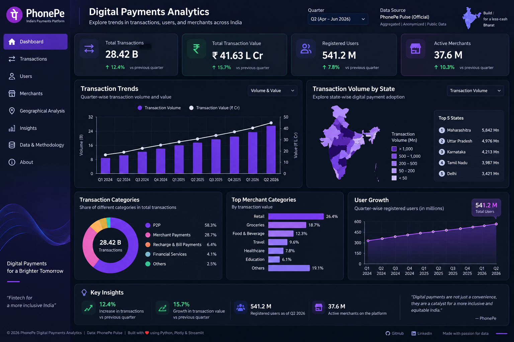

# PhonePe Pulse — Digital Payments Analytics



> **Portfolio project:** End-to-end analytics pipeline using PhonePe Pulse anonymised aggregate data.

**Preview note:** `assets/dashboard_preview.png` is a UI presentation preview with illustrative values. It is **not** an analytical result. Run the pipeline to populate the real dashboard from the current PhonePe Pulse release.

## Business Objective

Analyse digital-payment activity across time, payment categories, states, registered users and merchants.

### Questions answered
- How does transaction volume/value change by quarter?
- Which payment categories contribute most activity?
- Which states have the highest transaction volume/value?
- How do registered users and merchants change over time?
- What is the average transaction value?
- What are the quarter-over-quarter growth patterns?

## Tech Stack

**Python:** Pandas, NumPy  
**Visualisation:** Plotly  
**Dashboard:** Streamlit  
**SQL:** MySQL-compatible analytical SQL  
**Testing:** Pytest  
**Quality:** Ruff + GitHub Actions  
**Source:** PhonePe Pulse

## Project Architecture

```text
PhonePe Pulse JSON
        ↓
Extract → Validate → Transform
        ↓
Processed CSV tables
   ↙        ↓        ↘
 SQL    Python EDA   Streamlit
                       ↓
                  Interactive UI
```

## Repository Structure

```text
phonepe-pulse-digital-payments/
├── app/
│   └── streamlit_app.py
├── assets/
│   └── dashboard_preview.png
├── data/
│   ├── raw/                 # downloaded locally; gitignored
│   └── processed/           # generated locally; gitignored
├── docs/
│   ├── data_dictionary.md
│   └── interview_notes.md
├── notebooks/
│   └── 01_phonepe_eda.ipynb
├── sql/
│   └── analysis_queries.sql
├── src/phonepe_pulse/
│   ├── config.py
│   ├── pipeline.py
│   └── validation.py
├── tests/
│   └── test_pipeline.py
├── .github/workflows/ci.yml
├── .gitignore
├── pyproject.toml
├── requirements.txt
├── requirements-dev.txt
└── run_pipeline.py
```

## Official Data Source

- https://github.com/PhonePe/pulse
- https://www.phonepe.com/pulse/data/

PhonePe describes Pulse as anonymised and aggregated data. The current repository documentation states that the release covers **Q1 2018 through Q2 2026**, with refreshed/restated historical data and three mutually exclusive transaction categories: **P2P, Utilities and Business**.

The project intentionally does **not** bundle the raw dataset. Run the pipeline locally to download it.

Review the source's current licence and terms before redistributing source/derived data.

## Setup

### Windows

```bash
python -m venv .venv
.venv\Scripts\activate
pip install -r requirements.txt
```

### macOS/Linux

```bash
python3 -m venv .venv
source .venv/bin/activate
pip install -r requirements.txt
```

## Run the Pipeline

```bash
python run_pipeline.py
```

Creates:

```text
data/processed/
├── aggregated_transactions.csv
├── state_transactions.csv
├── users.csv
└── merchants.csv
```

## Run the Dashboard

```bash
streamlit run app/streamlit_app.py
```

Dashboard sections:

- Executive Overview
- Transaction Trends
- Payment Category Analysis
- Geographic Analysis
- Users & Merchants
- Data & Methodology

## SQL

Open `sql/analysis_queries.sql` for:

- quarterly trends
- category contribution
- average transaction value
- state rankings
- percentage share
- `LAG()` based QoQ growth
- user growth
- merchant growth

## Testing

```bash
pip install -r requirements-dev.txt
pytest
ruff check .
```

GitHub Actions runs the same lint/test checks on pushes and pull requests.

## Resume Bullet

**PhonePe Pulse Digital Payments Analytics | Python, SQL, Pandas, Plotly, Streamlit**

- Built an end-to-end analytics pipeline to transform PhonePe Pulse anonymised aggregate JSON into analysis-ready transaction, state, user and merchant datasets.
- Performed trend, category, geographic and growth analysis using Python/Pandas and SQL, including window-function based QoQ analysis.
- Developed an interactive Streamlit dashboard with KPI cards, transaction trends, category analysis, state comparisons and user/merchant growth views.

## 60-Second Interview Explanation

> I built an end-to-end digital payments analytics project using PhonePe Pulse anonymised aggregate data. The source is nested JSON organised by year and quarter, so I created a Python pipeline to extract, validate and transform it into transaction, state, user and merchant tables. I then used SQL for business analysis such as category contribution, state ranking, average transaction value and quarter-over-quarter growth. Finally, I built a Streamlit dashboard with Plotly to communicate the KPIs and trends. The main focus was creating a reproducible workflow from raw data to business insight.

## Disclaimer

Independent educational/portfolio project. It is not an official PhonePe product and does not imply PhonePe endorsement or sponsorship.
